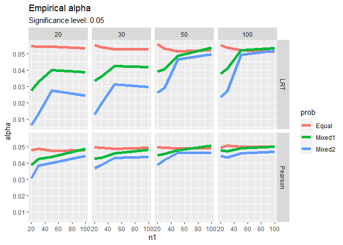
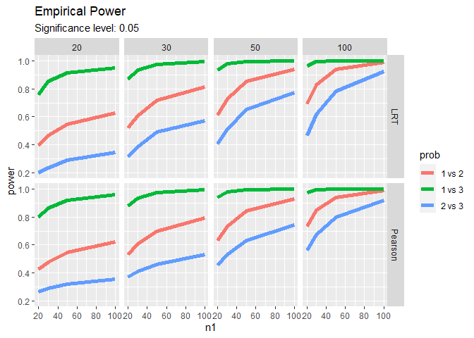

Chi Square Test for Homogeneity: Likelihood Ratio Test vs. Monte Carlo
Simulation
================
Chien-Lan Hsueh
2022-12-05

- [Packages](#packages)
- [Introduction: $\chi^2$ Test for
  Homogeneity](#introduction-chi2-test-for-homogeneity)
- [Derivation](#derivation)
  - [Degree of Freedom](#degree-of-freedom)
  - [Likelihood and LRT](#likelihood-and-lrt)
  - [Maximize $L$ in the Entire Parameter
    Space](#maximize-l-in-the-entire-parameter-space)
  - [Maximize $L$ in the Null space](#maximize-l-in-the-null-space)
  - [Expected Counts](#expected-counts)
  - [Large-Sample LRT](#large-sample-lrt)
  - [Pearson Test Statistic](#pearson-test-statistic)
- [Data Example](#data-example)
  - [Helper Functions for Chi-square
    Tests](#helper-functions-for-chi-square-tests)
  - [$\chi^2$ Test of Homogeneity](#chi2-test-of-homogeneity)
- [Simulation](#simulation)
  - [Helper Functions for Simulation](#helper-functions-for-simulation)
  - [Empirical alpha](#empirical-alpha)
  - [Empirical Power](#empirical-power)
- [Future Study](#future-study)

## Packages

The following packages are used in this project:

- `conflicted`: tools to deal with R package conflicts
- `here`: enables easy file referencing and builds file paths in a
  OS-independent way
- `scales`: formats and labels scales nicely for better visualization
- `skimr`: provides summary statistics about variables in data frames,
  tibbles, data tables and vectors
- `glue`: embeds and evaluates R expressions into strings to be printed
  as messages
- `gt`: pretty-looking tables
- `GGally`: extends ‘ggplot2’ by combining geometric objects with
  transformed data
- `moments`: calculate moments, kurtosis and skewness
- `cumstats`: efficiently compute cumulative standard deviation
- `tidyverse`: includes collections of useful packages like `dplyr`
  (data manipulation), `tidyr` (tidying data), `ggplots` (creating
  graphs), etc.
- `zealot`: provides a `%<-%` operator to perform multiple, unpacking,
  and destructuring assignment

In addition, the `pacman` package provides handy tools to manage R
packages (install, update, load and unload). We use its `p_laod()`
instead of `libarary()` to load the packages listed above.

``` r
# packages
if (!require("pacman")) utils::install.packages("pacman", dependencies = TRUE)
```

    ## Loading required package: pacman

``` r
pacman::p_load(
  conflicted, here, 
  scales, skimr, glue, gt, GGally, 
  moments, cumstats,
  tidyverse, zeallot
)

# resolve conflicts by setting preference
conflict_prefer("select", "dplyr", quiet = T)
conflict_prefer("filter", "dplyr", quiet = T)

# infix operator: string concatenation (ex: "act" %&% "5")
'%&%' <- function(x, y) paste0(x, y)

# infix operator: not %in%
'%notin%' <- Negate('%in%')
```

## Introduction: $\chi^2$ Test for Homogeneity

> Note: A different notation setup is used in this work!
>
> 1.  $I$ multinomial distributions where $i=1,\ldots, I$
> 2.  $J$ categorical variables where $j=1,\ldots, J$
> 3.  $n_{i\bullet}=\sum_{j=1}^J n_{ij}$ and
>     $n_{\bullet j}=\sum_{i=1}^I n_{ij}$

Consider the following $I$ independent multinomial distributions in
which each has $J$ categories:

|                 |   Cat 1    |   Cat 2    | $\cdots$ |  Cat $J$   |            Sample Size             |
|:---------------:|:----------:|:----------:|:--------:|:----------:|:----------------------------------:|
|  Multinomial 1  | $\pi_{11}$ | $\pi_{12}$ | $\cdots$ | $\pi_{1J}$ | $n_{1\bullet}=\sum_{j=1}^J n_{1j}$ |
|  Multinomial 2  | $\pi_{21}$ | $\pi_{22}$ | $\cdots$ | $\pi_{2J}$ | $n_{2\bullet}=\sum_{j=1}^J n_{2j}$ |
|    $\vdots$     |  $\cdots$  |  $\cdots$  | $\cdots$ |  $\cdots$  |              $\vdots$              |
| Multinomial $I$ | $\pi_{I1}$ | $\pi_{I2}$ | $\cdots$ | $\pi_{IJ}$ | $n_{I\bullet}=\sum_{j=1}^J n_{Ij}$ |

$$
\begin{aligned}
\text{Multinomial 1} &\sim Mult(n_{1\bullet}, \pi_{11}, \pi_{12}, \ldots, \pi_{1J}) \\
\text{Multinomial 2} &\sim Mult(n_{2\bullet}, \pi_{21}, \pi_{22}, \ldots, \pi_{2J}) \\
&\vdots \\
\text{Multinomial I} &\sim Mult(n_{I\bullet}, \pi_{I1}, \pi_{I2}, \ldots, \pi_{IJ}) \\
\end{aligned}
$$

A $\chi^2$ test of homogeneity compares the distributions of counts for
these $I$ groups. Using the probability table above, the test determines
whether all of the multinomial distributions have the same
probabilities. A hypothesis test is then set up as followed:

- $H_0:$ The distribution of the counts is the same for all $I$ groups
- $H_A:$ The distribution is not the same

In term of the cell probabilities, the null hypothesis means:

$$
H_0:
\left\{
\begin{array}{cc}
\pi_{11} = \pi_{21} = \ldots = \pi_{I1} \doteq \pi_1 & \text{for category } 1\\
\pi_{12} = \pi_{22} = \ldots = \pi_{I2} \doteq \pi_2 & \text{for category } 2\\
\vdots  & \\
\pi_{1J} = \pi_{2J} = \ldots = \pi_{IJ} \doteq \pi_J & \text{for category } J\\
\end{array}
\right. \\
$$

Above, we have defined $\pi_j \doteq \pi_{i1}$ under $H_0$. Note that we
have a constraint: $\sum_{j=1}^J \pi_j =1$

## Derivation

We will apply GOF for multinomial distribution ($H_A$) against a
restricted model ($H_0$).

### Degree of Freedom

- There are $I$ multinomials and each has a constraint
  $\sum_{j=1} \pi_{1j}=1$. Therefore, $\text{dim}(\Omega)= I*(J-1)$.
- Under $H_0$, $\sum_{j=1}^J \pi_{j}=1$ for all $j$. Therefore,
  $\text{dim}(\omega_0)=J-1$.

The degree of freedom is then
$\text{df}=\text{dim}(\Omega)-\text{dim}(\omega_0)=I*(J-1)-(J-1) =(I-1)(J-1)$.

### Likelihood and LRT

$$
\begin{aligned}
L(\pi_{11},\ldots,\pi_{IJ}) & = \text{products of } I \text{ multinomials} \\
&\propto \prod_{i=1}^I \left( \pi_{i1}^{n_{i1}}\cdots \pi_{iJ}^{n_{iJ}} \right) \\
&=\Pi_{i=1}^I\Pi_{j=1}^J \pi_{ij}^{n_{ij}} \\
l(\pi_{11},\ldots,\pi_{IJ}) &= \ln L \\
&=\sum_{i=1}^I \sum_{j=1}^J n_{ij}\ln\pi_{ij}+ \text{const} \\
\end{aligned}
$$

The likelihood ratio test is

$$
\begin{aligned}
\Lambda &= \frac{\max_{\pi's \in \omega_0} L(\pi_{11},\ldots,\pi_{IJ})}{\max_{\pi \in \Omega} L(\pi_{11},\ldots,\pi's_{IJ})} < c
\end{aligned}
$$

and we reject $H_0$ for $\Lambda < c$ where $c$ is chosen to control the
significance level $\alpha$.

### Maximize $L$ in the Entire Parameter Space

To maximize the likelihood function $L$ in the entire parameter space
$\Omega$, we need to maximize $l$ subject to $\sum_{j=1}^J \pi_{ij}=1$
for $i=1,\ldots,I$ because there are $I$ multinomials. This can be done
by using Lagrange multiplier:

$$
\begin{aligned}
l(\pi_{ij's}, \lambda's) &=
\sum_{i=1}^I\sum_{j=1}^J n_{ij} \ln\pi_{ij} 
+\sum_{i=1}^I\lambda_i(1-\sum_{j=1}^J\pi_{ij}) + \text{const} \\
\frac{\partial l}{\partial \pi_{ij}} &= 
n_{ij} \frac{1}{\pi_{ij}} -\lambda_i =0\\
\frac{\partial l}{\partial \lambda_i} &=1-\sum_{j=1}^J\pi_{ij}=0 \\
\end{aligned}
$$

Therefore,

$$
\begin{aligned}
\lambda_i &= \sum_{j=1}^J n_{ij} = n_{i +} \\
\hat{\pi}_{ij \text{MLE}} &= \frac{n_{ij}}{\sum_{j=1}^J n_{ij}}=n_{ij} /n_{i +}
\end{aligned}
$$

### Maximize $L$ in the Null space

Under the null hypothesis, $\pi_{ij}=\pi_j$. The likelihood function can
be rewritten as
$l=\sum_{i=1}^I \sum_{j=1}^J n_{ij} \ln\pi_j + \text{const}$. To
maximize the likelihood function $L$ in the null space $\omega_0$, we
need to maximize $l$ subject to $\sum_{j=1}^J \pi_{j}=1$. This can be
done by using Lagrange multiplier:

$$
\begin{aligned}
l(\pi_{j's}, \lambda) &=
\sum_{i=1}^I\sum_{j=1}^J n_{ij} \ln\pi_j 
+\lambda(1-\sum_{j=1}^J\pi_j) + \text{const} \\
\frac{\partial l}{\partial \pi_j} &= 
\sum_{i=1}^I n_{ij} \frac{1}{\pi_j} -\lambda =0\\
\frac{\partial l}{\partial \lambda} &=1-\sum_{j=1}^J\pi_j=0 \\
\\ 
\Rightarrow&
\begin{cases}
\lambda = \sum_{i=1}^I\sum_{j=1}^J n_{ij} = n \\
\tilde{\pi}_j=\frac{\sum_{i=1}^I n_{ij}}{n} =n_{\bullet j}/n
\end{cases}
\end{aligned}
$$

### Expected Counts

The expected count for cell $(i,j)$ is then
$\text{Exp}_{ij}=n_{i\bullet}\tilde{\pi}_j=n_{i\bullet}\frac{n_{\bullet J}}{n}=n_{i\bullet}\cdot n_{\bullet j}/n$.

### Large-Sample LRT

$$
\begin{aligned}
\Lambda &= \prod_{i=1}^I\prod_{j=1}^J \frac
{ \tilde{\pi}_j^{n_{ij}} }
{ \hat{\pi}_{ij\text{ MLE}}^{n_{ij}} } \\
-2\ln\Lambda &=2 \sum_{i=1}^I\sum_{j=1}^J n_{ij} \ln \frac
{ \hat{\pi}_{ij\text{ MLE}} } 
{ \tilde{\pi}_j } \\
&= 2 \sum_{i=1}^I\sum_{j=1}^J n_{ij} \ln \frac{n_{ij} /n_{i\bullet}}{n_{\bullet j}/n} \\
&= 2\sum_{i=1}^I\sum_{j=1}^J n_{ij} \ln \frac{n_{ij}}
{n_{i\bullet} \cdot n_{\bullet j} /n } \\
\Rightarrow
\text{LRT }\chi^2_{\text{obs}} &=2\sum_{i=1}^I\sum_{j=1}^J \text{Obs}_{ij} \ln \frac{\text{Obs}_{ij}}{\text{Exp}_{ij}} 
\quad \overset{H_0}{\dot\sim} \chi^2_{(I-1)(J-1)}
\end{aligned}
$$

To use this asymptotic result, we need to check if
$\text{Exp}_{ij} \ge 5$ for all cells.

### Pearson Test Statistic

Let $f(x) = x\ln\frac{x}{a}$ and expand $f(x)$ at $x=a$:

$$
\begin{aligned}
\because 
f'(x) &= \ln\frac{x}{a}-1 \\
f''(x) &= \frac{1}{x} \\
\therefore 
f(x) &= f(a) + f'(a)(x-a) + \frac{1}{2} f''(a) (x-a)^2 +\mathcal{O}(3) \\
&= a\ln\frac{a}{a} + (\ln\frac{a}{a}-1)(x-a) + \frac{1}{2} \frac{1}{a} (x-a)^2 +\mathcal{O}(3) \\
&\approx (a-x) + \frac{1}{2} \frac{(x-a)^2}{a} 
\end{aligned}
$$

For $x = \text{Obs}_{ij}$ and $a=\text{Exp}_{ij}$:

$$
\begin{aligned}
-2\ln\Lambda &= 2\sum_{i=1}^I\sum_{j=1}^J \text{Obs}_{ij} \ln \frac{\text{Obs}_{ij}}{\text{Exp}_{ij}} \\
&= 2\sum_{i=1}^I\sum_{j=1}^J f(\text{Obs}_{ij}) \\
&\approx 2\sum_{i=1}^I\sum_{j=1}^J \left[
(\text{Exp}_{ij}-\text{Obs}_{ij}) +\frac{1}{2} \frac{(\text{Obs}_{ij}-\text{Exp}_{ij})^2}{\text{Exp}_{ij}} 
\right] \\
&= 2\underbrace{\sum_{i=1}^I\sum_{j=1}^J (\text{Exp}_{ij}-\text{Obs}_{ij})}_{n-n=0} +
2\sum_{i=1}^I\sum_{j=1}^J \frac{1}{2} \frac{(\text{Obs}_{ij}-\text{Exp}_{ij})^2}{\text{Exp}_{ij}}  \\
\Rightarrow
\text{Pearson }\chi^2_{\text{obs}}
&= \sum_{i=1}^I\sum_{j=1}^J \frac{(\text{Obs}_{ij}-\text{Exp}_{ij})^2}{\text{Exp}_{ij}}
\quad \overset{H_0}{\dot\sim} \chi^2_{(I-1)(J-1)}
\end{aligned}
$$

## Data Example

A matrix is first created as the contingency table for the three
hospitals’ infection counts:

``` r
# create a matrix for the example data
example_obs <- matrix(
  data = c(41, 27, 51, 36, 3, 40, 169, 106, 109),
  nrow = 3, 
  byrow = TRUE,
  dimnames = list(
    LETTERS[1:3],
    c("Surgical Site Infections", "Pneumonia Infections", "Bloodstream Infections")
  )
)

example_obs
```

    ##   Surgical Site Infections Pneumonia Infections Bloodstream Infections
    ## A                       41                   27                     51
    ## B                       36                    3                     40
    ## C                      169                  106                    109

### Helper Functions for Chi-square Tests

To calculate $\chi^2$ test statistics and conduct a $\chi^2$ test of
independence or homogeneity, we define the following helper functions:

- `expected_counts()`: calculate the expected counts
- `chisq_stat()`: compute large-sample LRT or Pearson’s $\chi^2$ test
  statistic
- `chisq_test_GOF()`: our own version of `chisq.test()`

``` r
# calculate expected counts from a contingency table
expected_counts <- function(obs){
  # convert a vector to a nx1 matrix
  obs <- as.matrix(obs)
  
  # column sums (as 1xm matrix) and row sums (as nx1 matrix)
  csum <- colSums(obs) %>% as.matrix() %>% t()
  rsum <- rowSums(obs) %>% as.matrix()
  
  # expected counts
  exp <- rsum %*% csum / sum(csum)
  # add 0.5 to any expected counts that end up being 0
  exp[exp == 0] <- 0.5
  
  return(exp)
}

# LRT or Pearson test statistic
chisq_stat <- function(obs, exp = expected_counts(obs), type = "Pearson"){
  # return Pearson's test stat by default
  switch (type,
    LRT = list(type = "LRT", test_stat = 2*sum(obs*log(obs/exp))),
    list(type = "Pearson", test_stat = sum((obs-exp)^2/exp))
  )
}

# chi-square test
chisq_test_GOF <- function(obs, alpha = 0.05, type = "Pearson"){
  # degree of freedom
  ## df = k-1 if one-dimension contingency table
  ## df = (R-1)(C-1) if two-dimension contingency table
  df <- prod(dim(as.matrix(obs))-1)
  df <- ifelse(df == 0, length(obs)-1, df)
  
  # get test stat
  c(type, test_stat) %<-% chisq_stat(obs, type = type)
  
  # p-value and critical value
  p_value <- pchisq(test_stat, df, lower.tail = F)
  critical <- qchisq(alpha, df, lower.tail = F)

  # print out the test summary
  print(glue(
    "{type} Chi-squared test\n",
    "X-squared = {round(test_stat, 3)}, df = {df},",
    "p-value = {label_scientific(4)(p_value)}\n",
    "alpha = {alpha}, critical value = {round(critical, 3)}\n",
    "Reject H0? {p_value < alpha}"
  ))

  # return results
  list(
    type = type,
    test_stat = test_stat,
    df = df,
    p_value = p_value,
    alpha = alpha,
    crtical = critical)
}
```

### $\chi^2$ Test of Homogeneity

Next, we call `chisq_test_GOF()` to report Pearson’s $\chi^2$ test
statistic, degree of freedom and p-value and perform a $\chi^2$ test of
homogeneity. By default, the test is done with significance level
$\alpha=0.05$, and it reports the critical value and test decision:

``` r
# perform Pearson's chi-square test
test_Pearson <- chisq_test_GOF(example_obs)
```

    ## Pearson Chi-squared test
    ## X-squared = 30.696, df = 4,p-value = 3.531e-06
    ## alpha = 0.05, critical value = 9.488
    ## Reject H0? TRUE

``` r
# double check our results with R's `chisq.test()`
chisq.test(example_obs)
```

    ## 
    ##  Pearson's Chi-squared test
    ## 
    ## data:  example_obs
    ## X-squared = 30.696, df = 4, p-value = 3.531e-06

R’s base function `chisq.test()` is also called to double check our
result. Both methods give the same results: the p-value is very small
and the test decision is to reject the null hypothesis. There is
evidence that the distributions of the infection types are different
among the three hospitals.

In addition to Pearson’s test statistics, we can also use the
large-sample LRT test statistic to conduct the test.

``` r
# perform LRT chi-square test
test_LRT <- chisq_test_GOF(example_obs, type = "LRT")
```

    ## LRT Chi-squared test
    ## X-squared = 37, df = 4,p-value = 1.801e-07
    ## alpha = 0.05, critical value = 9.488
    ## Reject H0? TRUE

We end up with the same test decision: reject the null hypothesis.

## Simulation

In this section, we will do a simulation study to:

- Determine how well the asymptotic rejection region performs at
  controlling $\alpha$
- Determine the power of the asymptotic test when comparing certain
  alternative situations

The simulation is set up in the following code chunk. In addition of
using Pearson’s test statistic, LRT test statistics is also included in
this work.

``` r
# seed for random number generator
seed <- 2022

# significance level and cutoff
alpha <- 0.05
cutoff <- qchisq(alpha, df = 2, lower.tail = F)

# simulation size: # of contingency tables in each study case
N <- 50*1000

# sample sizes: total counts in each contingency table
sample_sizes <- c(20, 30, 50, 100)

# probabilities of multinomial distribution
probs <- list(c(1, 1, 1), c(1, 3, 6), c(1, 1, 8))

# types of chi-square test statistics
types <- c("Pearson", "LRT")
```

### Helper Functions for Simulation

The helper function `rejection_rate()` generates $N$ samples of
contingency tables from 2 specified multinomials and calls the helper
function `chisq_stat()` defined earlier to get Pearson’s or LRT test
statistic for each sample. By comparing the test statistics and the
theoretical cutoff, it returns the empirical rejection rate. If we
generate the data under $H_0$, this will be our empirical alpha; if we
generate the data under $H_A$, this will be our empirical test power.

To have a reproducible result and a fair comparison among the study
cases, the random number generator is reset every time when this
function is called.

``` r
# simulate data and get empirical rejection rate
rejection_rate <- function(N, n1, p1, n2, p2, cutoff, type = "Pearson", seed = 2022){
  # make the simulation reproducible 
  set.seed(seed)
  
  # simulate N contingency tables from 2 multinomials
  data <- replicate(
    N, 
    cbind(rmultinom(1, n1, p1), rmultinom(1, n2, p2)) %>% t(), 
    simplify = F)
  
  # return the empirical rejection rate
  ## `chisq_stat(x, type = type)$test_stat` gives Pearson's or LRT test statistics
  mean(sapply(data, function(x){ chisq_stat(x, type = type)$test_stat }) > cutoff, na.rm = T)
}
```

### Empirical alpha

To investigate how good the asymptotic approximation is for the alpha
control, we generate the two multinomials using same probabilities in
each sample contingency table. The workflow is:

1.  set up a data frame populated by study cases of interest
2.  use the helper function `rejection_rate()` to compute empirical
    alpha for each study case
3.  tidy up results with proper case labels

``` r
# MC simulation for empirical alpha
df_alpha <- expand_grid(
    n1 = sample_sizes,
    p1 = probs,
    n2 = sample_sizes,
    type = types
  ) %>% 
  rowwise() %>% 
  mutate(
    alpha = rejection_rate(N, n1, p1, n2, p2 = p1, cutoff, type, seed),
    # create legend labels
    match = match(list(p1), probs),
    prob = c("Equal", "Mixed1", "Mixed2")[match]
  )

# print the results
df_alpha %>% 
  select(-match) %>% mutate(across(everything(), toString))
```

<div class="kable-table">

| n1  | p1      | n2  | type    | alpha               | prob   |
|:----|:--------|:----|:--------|:--------------------|:-------|
| 20  | 1, 1, 1 | 20  | Pearson | 0.04772             | Equal  |
| 20  | 1, 1, 1 | 20  | LRT     | 0.0547239755535517  | Equal  |
| 20  | 1, 1, 1 | 30  | Pearson | 0.04968             | Equal  |
| 20  | 1, 1, 1 | 30  | LRT     | 0.0552741686853116  | Equal  |
| 20  | 1, 1, 1 | 50  | Pearson | 0.04978             | Equal  |
| 20  | 1, 1, 1 | 50  | LRT     | 0.0559525954397133  | Equal  |
| 20  | 1, 1, 1 | 100 | Pearson | 0.04956             | Equal  |
| 20  | 1, 1, 1 | 100 | LRT     | 0.0552574677664771  | Equal  |
| 20  | 1, 3, 6 | 20  | Pearson | 0.03888             | Mixed1 |
| 20  | 1, 3, 6 | 20  | LRT     | 0.0274462080215427  | Mixed1 |
| 20  | 1, 3, 6 | 30  | Pearson | 0.04282             | Mixed1 |
| 20  | 1, 3, 6 | 30  | LRT     | 0.033462553808833   | Mixed1 |
| 20  | 1, 3, 6 | 50  | Pearson | 0.04464             | Mixed1 |
| 20  | 1, 3, 6 | 50  | LRT     | 0.0390200261509875  | Mixed1 |
| 20  | 1, 3, 6 | 100 | Pearson | 0.04786             | Mixed1 |
| 20  | 1, 3, 6 | 100 | LRT     | 0.0378978128852564  | Mixed1 |
| 20  | 1, 1, 8 | 20  | Pearson | 0.0307              | Mixed2 |
| 20  | 1, 1, 8 | 20  | LRT     | 0.00632230293247242 | Mixed2 |
| 20  | 1, 1, 8 | 30  | Pearson | 0.03696             | Mixed2 |
| 20  | 1, 1, 8 | 30  | LRT     | 0.0129549835582266  | Mixed2 |
| 20  | 1, 1, 8 | 50  | Pearson | 0.03884             | Mixed2 |
| 20  | 1, 1, 8 | 50  | LRT     | 0.0261709802269556  | Mixed2 |
| 20  | 1, 1, 8 | 100 | Pearson | 0.04456             | Mixed2 |
| 20  | 1, 1, 8 | 100 | LRT     | 0.0235051653970573  | Mixed2 |
| 30  | 1, 1, 1 | 20  | Pearson | 0.04894             | Equal  |
| 30  | 1, 1, 1 | 20  | LRT     | 0.0542921204356182  | Equal  |
| 30  | 1, 1, 1 | 30  | Pearson | 0.04956             | Equal  |
| 30  | 1, 1, 1 | 30  | LRT     | 0.0542421696867875  | Equal  |
| 30  | 1, 1, 1 | 50  | Pearson | 0.04936             | Equal  |
| 30  | 1, 1, 1 | 50  | LRT     | 0.05322             | Equal  |
| 30  | 1, 1, 1 | 100 | Pearson | 0.0506              | Equal  |
| 30  | 1, 1, 1 | 100 | LRT     | 0.0538410768215364  | Equal  |
| 30  | 1, 3, 6 | 20  | Pearson | 0.04252             | Mixed1 |
| 30  | 1, 3, 6 | 20  | LRT     | 0.032839435817068   | Mixed1 |
| 30  | 1, 3, 6 | 30  | Pearson | 0.04312             | Mixed1 |
| 30  | 1, 3, 6 | 30  | LRT     | 0.0359525574499629  | Mixed1 |
| 30  | 1, 3, 6 | 50  | Pearson | 0.04574             | Mixed1 |
| 30  | 1, 3, 6 | 50  | LRT     | 0.0408124645177569  | Mixed1 |
| 30  | 1, 3, 6 | 100 | Pearson | 0.04718             | Mixed1 |
| 30  | 1, 3, 6 | 100 | LRT     | 0.0408943684045554  | Mixed1 |
| 30  | 1, 1, 8 | 20  | Pearson | 0.03844             | Mixed2 |
| 30  | 1, 1, 8 | 20  | LRT     | 0.0132463424278371  | Mixed2 |
| 30  | 1, 1, 8 | 30  | Pearson | 0.03868             | Mixed2 |
| 30  | 1, 1, 8 | 30  | LRT     | 0.0193528446779677  | Mixed2 |
| 30  | 1, 1, 8 | 50  | Pearson | 0.04182             | Mixed2 |
| 30  | 1, 1, 8 | 50  | LRT     | 0.0290831198657362  | Mixed2 |
| 30  | 1, 1, 8 | 100 | Pearson | 0.0435              | Mixed2 |
| 30  | 1, 1, 8 | 100 | LRT     | 0.0272908322937868  | Mixed2 |
| 50  | 1, 1, 1 | 20  | Pearson | 0.04766             | Equal  |
| 50  | 1, 1, 1 | 20  | LRT     | 0.0544923126201153  | Equal  |
| 50  | 1, 1, 1 | 30  | Pearson | 0.0487              | Equal  |
| 50  | 1, 1, 1 | 30  | LRT     | 0.0528221128845154  | Equal  |
| 50  | 1, 1, 1 | 50  | Pearson | 0.04906             | Equal  |
| 50  | 1, 1, 1 | 50  | LRT     | 0.05164             | Equal  |
| 50  | 1, 1, 1 | 100 | Pearson | 0.05004             | Equal  |
| 50  | 1, 1, 1 | 100 | LRT     | 0.0523              | Equal  |
| 50  | 1, 3, 6 | 20  | Pearson | 0.04378             | Mixed1 |
| 50  | 1, 3, 6 | 20  | LRT     | 0.0401149399074095  | Mixed1 |
| 50  | 1, 3, 6 | 30  | Pearson | 0.046               | Mixed1 |
| 50  | 1, 3, 6 | 30  | LRT     | 0.0424248769762329  | Mixed1 |
| 50  | 1, 3, 6 | 50  | Pearson | 0.048               | Mixed1 |
| 50  | 1, 3, 6 | 50  | LRT     | 0.0486479936993881  | Mixed1 |
| 50  | 1, 3, 6 | 100 | Pearson | 0.04908             | Mixed1 |
| 50  | 1, 3, 6 | 100 | LRT     | 0.052270762550009   | Mixed1 |
| 50  | 1, 1, 8 | 20  | Pearson | 0.03996             | Mixed2 |
| 50  | 1, 1, 8 | 20  | LRT     | 0.0276054428861895  | Mixed2 |
| 50  | 1, 1, 8 | 30  | Pearson | 0.04308             | Mixed2 |
| 50  | 1, 1, 8 | 30  | LRT     | 0.0312218882331     | Mixed2 |
| 50  | 1, 1, 8 | 50  | Pearson | 0.04628             | Mixed2 |
| 50  | 1, 1, 8 | 50  | LRT     | 0.0464561632386815  | Mixed2 |
| 50  | 1, 1, 8 | 100 | Pearson | 0.04592             | Mixed2 |
| 50  | 1, 1, 8 | 100 | LRT     | 0.0494363408622571  | Mixed2 |
| 100 | 1, 1, 1 | 20  | Pearson | 0.04802             | Equal  |
| 100 | 1, 1, 1 | 20  | LRT     | 0.0533755105309522  | Equal  |
| 100 | 1, 1, 1 | 30  | Pearson | 0.0493              | Equal  |
| 100 | 1, 1, 1 | 30  | LRT     | 0.0529010580211604  | Equal  |
| 100 | 1, 1, 1 | 50  | Pearson | 0.0491              | Equal  |
| 100 | 1, 1, 1 | 50  | LRT     | 0.05224             | Equal  |
| 100 | 1, 1, 1 | 100 | Pearson | 0.05006             | Equal  |
| 100 | 1, 1, 1 | 100 | LRT     | 0.05136             | Equal  |
| 100 | 1, 3, 6 | 20  | Pearson | 0.04882             | Mixed1 |
| 100 | 1, 3, 6 | 20  | LRT     | 0.0387662382137394  | Mixed1 |
| 100 | 1, 3, 6 | 30  | Pearson | 0.04832             | Mixed1 |
| 100 | 1, 3, 6 | 30  | LRT     | 0.0420645700553756  | Mixed1 |
| 100 | 1, 3, 6 | 50  | Pearson | 0.0507              | Mixed1 |
| 100 | 1, 3, 6 | 50  | LRT     | 0.0537774918579872  | Mixed1 |
| 100 | 1, 3, 6 | 100 | Pearson | 0.0501              | Mixed1 |
| 100 | 1, 3, 6 | 100 | LRT     | 0.0533621344853794  | Mixed1 |
| 100 | 1, 1, 8 | 20  | Pearson | 0.04452             | Mixed2 |
| 100 | 1, 1, 8 | 20  | LRT     | 0.0244173140954495  | Mixed2 |
| 100 | 1, 1, 8 | 30  | Pearson | 0.04382             | Mixed2 |
| 100 | 1, 1, 8 | 30  | LRT     | 0.0296104798939845  | Mixed2 |
| 100 | 1, 1, 8 | 50  | Pearson | 0.04618             | Mixed2 |
| 100 | 1, 1, 8 | 50  | LRT     | 0.0495690960098492  | Mixed2 |
| 100 | 1, 1, 8 | 100 | Pearson | 0.04708             | Mixed2 |
| 100 | 1, 1, 8 | 100 | LRT     | 0.0519062287474497  | Mixed2 |

</div>

Faceted line plots are then created below for a graphical comparison of
the study cases:

``` r
# plot comparison
df_alpha %>% 
  ggplot(aes(n1, alpha, col = prob)) +
  geom_line(linewidth = 2) +
  facet_grid(rows = vars(type), cols = vars(n2)) +
  labs(
    title = "Empirical alpha",
    subtitle = glue("Significance level: {alpha}")
  )
```

<!-- -->

It’s clear to see that the sample sizes $n1$ and $n2$ have a great
impact to how good the asymptotic approximation is. When we have small
sample sizes, $\chi^2_\text{df}$ does not approximate well to
$-2\ln\Lambda$ resulting to underestimate $\alpha$. If we use the
$(1-\alpha)100\%$ quantile of the random samples to control the
significant level, we will end up have a probability larger than
$\alpha$ to make a Type I error.

Another factor affecting the goodness of the large-sample asymptotic
approximation is the multinomial probabilities $\pi_j$. When we have an
unequal (unbalanced) probabilities across categories, we will need
bigger sample sizes to get a good approximation.

Compared to LRT test statistics, Pearson’s test statistic performs much
better. LRT test statistic performs very poorly in the case of small
sample sizes.

### Empirical Power

Using the same workflow, we next study how good the asymptotic
approximation is for the test power. To inspect the power, the two
multinomials are generated using different probabilities in each sample
contingency table in the following three scenarios:

- Compare Equal vs Mixed 1 (prob 1 vs. 2)
- Compare Equal vs Mixed 2 (prob 1 vs. 3)
- Compare Mixed 1 vs Mixed 2 (prob 2 vs. 3)

``` r
# MC simulation for empirical alpha
df_power <- expand_grid(
    n1 = sample_sizes,
    p1 = probs,
    n2 = sample_sizes,
    p2 = probs,
    type = types
  ) %>% 
  rowwise() %>% 
  mutate(
    match1 = match(list(p1), probs),
    match2 = match(list(p2), probs)
  ) %>% 
  # remove unwanted combinations
  filter(match1 < match2) %>% 
  mutate(
    power = rejection_rate(N, n1, p1, n2, p2, cutoff, type, seed),
    # create legend labels
    prob = glue("{match1} vs {match2}") 
  )

# print the results
df_power %>% 
  select(-match1, -match2) %>% 
  mutate(across(everything(), toString))
```

<div class="kable-table">

| n1  | p1      | n2  | p2      | type    | power             | prob   |
|:----|:--------|:----|:--------|:--------|:------------------|:-------|
| 20  | 1, 1, 1 | 20  | 1, 3, 6 | Pearson | 0.4237            | 1 vs 2 |
| 20  | 1, 1, 1 | 20  | 1, 3, 6 | LRT     | 0.395253236429707 | 1 vs 2 |
| 20  | 1, 1, 1 | 20  | 1, 1, 8 | Pearson | 0.79894           | 1 vs 3 |
| 20  | 1, 1, 1 | 20  | 1, 1, 8 | LRT     | 0.760100227319694 | 1 vs 3 |
| 20  | 1, 1, 1 | 30  | 1, 3, 6 | Pearson | 0.53132           | 1 vs 2 |
| 20  | 1, 1, 1 | 30  | 1, 3, 6 | LRT     | 0.520271115745568 | 1 vs 2 |
| 20  | 1, 1, 1 | 30  | 1, 1, 8 | Pearson | 0.87948           | 1 vs 3 |
| 20  | 1, 1, 1 | 30  | 1, 1, 8 | LRT     | 0.871474853775739 | 1 vs 3 |
| 20  | 1, 1, 1 | 50  | 1, 3, 6 | Pearson | 0.63262           | 1 vs 2 |
| 20  | 1, 1, 1 | 50  | 1, 3, 6 | LRT     | 0.610955818770487 | 1 vs 2 |
| 20  | 1, 1, 1 | 50  | 1, 1, 8 | Pearson | 0.94116           | 1 vs 3 |
| 20  | 1, 1, 1 | 50  | 1, 1, 8 | LRT     | 0.936104882532372 | 1 vs 3 |
| 20  | 1, 1, 1 | 100 | 1, 3, 6 | Pearson | 0.73572           | 1 vs 2 |
| 20  | 1, 1, 1 | 100 | 1, 3, 6 | LRT     | 0.691554737073883 | 1 vs 2 |
| 20  | 1, 1, 1 | 100 | 1, 1, 8 | Pearson | 0.97468           | 1 vs 3 |
| 20  | 1, 1, 1 | 100 | 1, 1, 8 | LRT     | 0.964544544544545 | 1 vs 3 |
| 20  | 1, 3, 6 | 20  | 1, 1, 8 | Pearson | 0.26678           | 2 vs 3 |
| 20  | 1, 3, 6 | 20  | 1, 1, 8 | LRT     | 0.198945166327823 | 2 vs 3 |
| 20  | 1, 3, 6 | 30  | 1, 1, 8 | Pearson | 0.36952           | 2 vs 3 |
| 20  | 1, 3, 6 | 30  | 1, 1, 8 | LRT     | 0.315725486304089 | 2 vs 3 |
| 20  | 1, 3, 6 | 50  | 1, 1, 8 | Pearson | 0.45516           | 2 vs 3 |
| 20  | 1, 3, 6 | 50  | 1, 1, 8 | LRT     | 0.40507408346199  | 2 vs 3 |
| 20  | 1, 3, 6 | 100 | 1, 1, 8 | Pearson | 0.56326           | 2 vs 3 |
| 20  | 1, 3, 6 | 100 | 1, 1, 8 | LRT     | 0.467494805105839 | 2 vs 3 |
| 30  | 1, 1, 1 | 20  | 1, 3, 6 | Pearson | 0.47714           | 1 vs 2 |
| 30  | 1, 1, 1 | 20  | 1, 3, 6 | LRT     | 0.465872475606989 | 1 vs 2 |
| 30  | 1, 1, 1 | 20  | 1, 1, 8 | Pearson | 0.8649            | 1 vs 3 |
| 30  | 1, 1, 1 | 20  | 1, 1, 8 | LRT     | 0.851933102771899 | 1 vs 3 |
| 30  | 1, 1, 1 | 30  | 1, 3, 6 | Pearson | 0.60518           | 1 vs 2 |
| 30  | 1, 1, 1 | 30  | 1, 3, 6 | LRT     | 0.609175764647054 | 1 vs 2 |
| 30  | 1, 1, 1 | 30  | 1, 1, 8 | Pearson | 0.93644           | 1 vs 3 |
| 30  | 1, 1, 1 | 30  | 1, 1, 8 | LRT     | 0.935352131033584 | 1 vs 3 |
| 30  | 1, 1, 1 | 50  | 1, 3, 6 | Pearson | 0.73304           | 1 vs 2 |
| 30  | 1, 1, 1 | 50  | 1, 3, 6 | LRT     | 0.729035239281553 | 1 vs 2 |
| 30  | 1, 1, 1 | 50  | 1, 1, 8 | Pearson | 0.97978           | 1 vs 3 |
| 30  | 1, 1, 1 | 50  | 1, 1, 8 | LRT     | 0.978789101917255 | 1 vs 3 |
| 30  | 1, 1, 1 | 100 | 1, 3, 6 | Pearson | 0.84752           | 1 vs 2 |
| 30  | 1, 1, 1 | 100 | 1, 3, 6 | LRT     | 0.827136542730855 | 1 vs 2 |
| 30  | 1, 1, 1 | 100 | 1, 1, 8 | Pearson | 0.99484           | 1 vs 3 |
| 30  | 1, 1, 1 | 100 | 1, 1, 8 | LRT     | 0.993479608776527 | 1 vs 3 |
| 30  | 1, 3, 6 | 20  | 1, 1, 8 | Pearson | 0.28878           | 2 vs 3 |
| 30  | 1, 3, 6 | 20  | 1, 1, 8 | LRT     | 0.232244644352595 | 2 vs 3 |
| 30  | 1, 3, 6 | 30  | 1, 1, 8 | Pearson | 0.4087            | 2 vs 3 |
| 30  | 1, 3, 6 | 30  | 1, 1, 8 | LRT     | 0.387465035362609 | 2 vs 3 |
| 30  | 1, 3, 6 | 50  | 1, 1, 8 | Pearson | 0.53338           | 2 vs 3 |
| 30  | 1, 3, 6 | 50  | 1, 1, 8 | LRT     | 0.512673200405542 | 2 vs 3 |
| 30  | 1, 3, 6 | 100 | 1, 1, 8 | Pearson | 0.67112           | 2 vs 3 |
| 30  | 1, 3, 6 | 100 | 1, 1, 8 | LRT     | 0.617051115669611 | 2 vs 3 |
| 50  | 1, 1, 1 | 20  | 1, 3, 6 | Pearson | 0.54682           | 1 vs 2 |
| 50  | 1, 1, 1 | 20  | 1, 3, 6 | LRT     | 0.5476060812344   | 1 vs 2 |
| 50  | 1, 1, 1 | 20  | 1, 1, 8 | Pearson | 0.9211            | 1 vs 3 |
| 50  | 1, 1, 1 | 20  | 1, 1, 8 | LRT     | 0.913539462138027 | 1 vs 3 |
| 50  | 1, 1, 1 | 30  | 1, 3, 6 | Pearson | 0.70038           | 1 vs 2 |
| 50  | 1, 1, 1 | 30  | 1, 3, 6 | LRT     | 0.718039003250271 | 1 vs 2 |
| 50  | 1, 1, 1 | 30  | 1, 1, 8 | Pearson | 0.97614           | 1 vs 3 |
| 50  | 1, 1, 1 | 30  | 1, 1, 8 | LRT     | 0.976778033627319 | 1 vs 3 |
| 50  | 1, 1, 1 | 50  | 1, 3, 6 | Pearson | 0.84376           | 1 vs 2 |
| 50  | 1, 1, 1 | 50  | 1, 3, 6 | LRT     | 0.85319644794471  | 1 vs 2 |
| 50  | 1, 1, 1 | 50  | 1, 1, 8 | Pearson | 0.99594           | 1 vs 3 |
| 50  | 1, 1, 1 | 50  | 1, 1, 8 | LRT     | 0.996205852674067 | 1 vs 3 |
| 50  | 1, 1, 1 | 100 | 1, 3, 6 | Pearson | 0.94246           | 1 vs 2 |
| 50  | 1, 1, 1 | 100 | 1, 3, 6 | LRT     | 0.939018780375607 | 1 vs 2 |
| 50  | 1, 1, 1 | 100 | 1, 1, 8 | Pearson | 0.99988           | 1 vs 3 |
| 50  | 1, 1, 1 | 100 | 1, 1, 8 | LRT     | 0.999859991599496 | 1 vs 3 |
| 50  | 1, 3, 6 | 20  | 1, 1, 8 | Pearson | 0.31758           | 2 vs 3 |
| 50  | 1, 3, 6 | 20  | 1, 1, 8 | LRT     | 0.290301662646227 | 2 vs 3 |
| 50  | 1, 3, 6 | 30  | 1, 1, 8 | Pearson | 0.46272           | 2 vs 3 |
| 50  | 1, 3, 6 | 30  | 1, 1, 8 | LRT     | 0.489148471615721 | 2 vs 3 |
| 50  | 1, 3, 6 | 50  | 1, 1, 8 | Pearson | 0.63494           | 2 vs 3 |
| 50  | 1, 3, 6 | 50  | 1, 1, 8 | LRT     | 0.652210073635312 | 2 vs 3 |
| 50  | 1, 3, 6 | 100 | 1, 1, 8 | Pearson | 0.80034           | 2 vs 3 |
| 50  | 1, 3, 6 | 100 | 1, 1, 8 | LRT     | 0.785701361104968 | 2 vs 3 |
| 100 | 1, 1, 1 | 20  | 1, 3, 6 | Pearson | 0.62426           | 1 vs 2 |
| 100 | 1, 1, 1 | 20  | 1, 3, 6 | LRT     | 0.627593738623953 | 1 vs 2 |
| 100 | 1, 1, 1 | 20  | 1, 1, 8 | Pearson | 0.96066           | 1 vs 3 |
| 100 | 1, 1, 1 | 20  | 1, 1, 8 | LRT     | 0.952314201905355 | 1 vs 3 |
| 100 | 1, 1, 1 | 30  | 1, 3, 6 | Pearson | 0.79644           | 1 vs 2 |
| 100 | 1, 1, 1 | 30  | 1, 3, 6 | LRT     | 0.813354199269692 | 1 vs 2 |
| 100 | 1, 1, 1 | 30  | 1, 1, 8 | Pearson | 0.99378           | 1 vs 3 |
| 100 | 1, 1, 1 | 30  | 1, 1, 8 | LRT     | 0.993724669891489 | 1 vs 3 |
| 100 | 1, 1, 1 | 50  | 1, 3, 6 | Pearson | 0.93236           | 1 vs 2 |
| 100 | 1, 1, 1 | 50  | 1, 3, 6 | LRT     | 0.939722942678489 | 1 vs 2 |
| 100 | 1, 1, 1 | 50  | 1, 1, 8 | Pearson | 0.99972           | 1 vs 3 |
| 100 | 1, 1, 1 | 50  | 1, 1, 8 | LRT     | 0.999757565962261 | 1 vs 3 |
| 100 | 1, 1, 1 | 100 | 1, 3, 6 | Pearson | 0.99166           | 1 vs 2 |
| 100 | 1, 1, 1 | 100 | 1, 3, 6 | LRT     | 0.991939355148412 | 1 vs 2 |
| 100 | 1, 1, 1 | 100 | 1, 1, 8 | Pearson | 1                 | 1 vs 3 |
| 100 | 1, 1, 1 | 100 | 1, 1, 8 | LRT     | 1                 | 1 vs 3 |
| 100 | 1, 3, 6 | 20  | 1, 1, 8 | Pearson | 0.35602           | 2 vs 3 |
| 100 | 1, 3, 6 | 20  | 1, 1, 8 | LRT     | 0.346010672914226 | 2 vs 3 |
| 100 | 1, 3, 6 | 30  | 1, 1, 8 | Pearson | 0.53104           | 2 vs 3 |
| 100 | 1, 3, 6 | 30  | 1, 1, 8 | LRT     | 0.569854705702692 | 2 vs 3 |
| 100 | 1, 3, 6 | 50  | 1, 1, 8 | Pearson | 0.74158           | 2 vs 3 |
| 100 | 1, 3, 6 | 50  | 1, 1, 8 | LRT     | 0.773659974956578 | 2 vs 3 |
| 100 | 1, 3, 6 | 100 | 1, 1, 8 | Pearson | 0.92016           | 2 vs 3 |
| 100 | 1, 3, 6 | 100 | 1, 1, 8 | LRT     | 0.923775426525592 | 2 vs 3 |

</div>

Faceted line plots are created below for comparison of the study cases:

``` r
# plot comparison
df_power %>% 
  ggplot(aes(n1, power, col = prob)) +
  geom_line(linewidth = 2) +
  facet_grid(rows = vars(type), cols = vars(n2)) +
  labs(
    title = "Empirical Power",
    subtitle = glue("Significance level: {alpha}")
  )
```

<!-- -->

Compared to the previous study on the empirical alpha, we have similar
conclusions on the empirical power: sample sizes play an important role
in how well we can apply large-sample LRT theory. We also notice that
the greater difference between $H_0$ and $H_A$, the better the
asymptotic test performs (with fixed sample sizes). Among these three
scenario, the difference between equal mode ($p_1$) and mixed 2 ($p_3$)
is the largest. Therefore, it has the best performance on the empirical
power (with fixed sample sizes).

## Future Study

There are some interesting topics remained for further studies. One is
how to deal with $\ln 0$. In this study, inconsistent methods are used
to avoid $\ln 0$. For the cells with zero expected counts
(i.e. $\ln \text{Exp}_{ij} =\ln 0$), we add 0.5 to the zero expected
counts. For the cells with zero observed counts
(i.e. $\ln \text{Obs}_{ij}=\ln 0$) that cause problems in calculating
LRT test statistics, we just remove them from the calculating rejection
rates without any study to support if these are appropriate.

The other is the cells with smaller counts. We are often told the rule
of the thumb to apply the large-sample LRT theory: “at least 80% of
expected counts are greater than 5 and none are less than 1”, or “none
of expected counts are zero”, etc. It will be interesting to keep track
of number of such cells in each sampled contingency table and study how
these impact the asymptotic test results.
